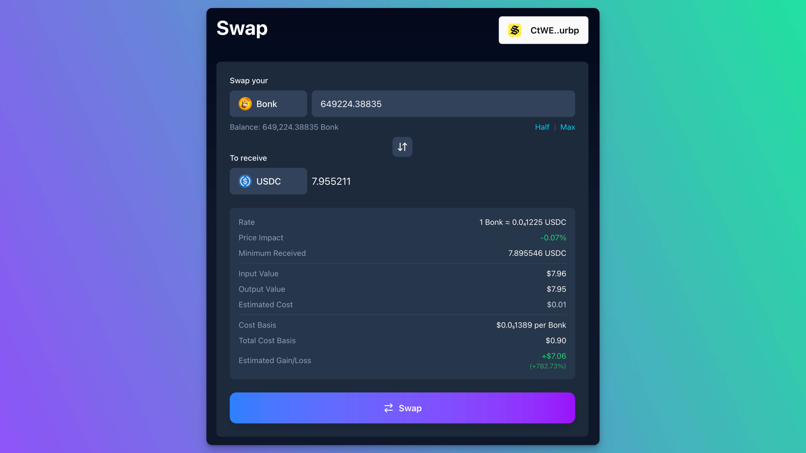

# Swapsies

Swapsies is a tool to help you make more careful swaps on Solana. It allows you to set a cost basis for tokens, and see information on the estimated gain/loss when you execute a swap.

Swaps are perfomed using [Jupiter Ultra](https://dev.jup.ag/docs/ultra), with no additional fees.

Note that Swapsies is not a power tool for traders. It's for people who need to occasionally trade and would like more information when they do.

The cost basis data is set manually, and it's recommended that you use values calculated by tax software (like [Awaken](https://awaken.tax/) or [Koinly](https://koinly.io/)) that has all relevant wallets imported.

Cost Basis data can be imported/exported in CSV format, so that it can be easily saved or shared. 

## Development

Swapsies is built with [Tanstack Start](https://tanstack.com/start/latest).

Install dependencies:
`pnpm install`

Run the dev server:
`pnpm dev`

### Environment Variables

You will need a `.env` file, you can copy `.env.copy` to `.env`

You can get a Jupiter API key from [The Jupiter Developer Portal](https://dev.jup.ag/portal/setup)

Note that the app does not require its own RPC.
